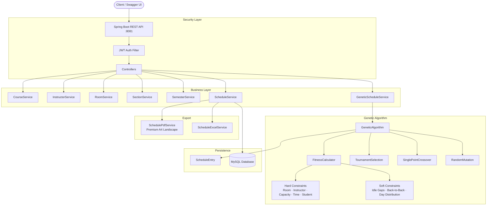
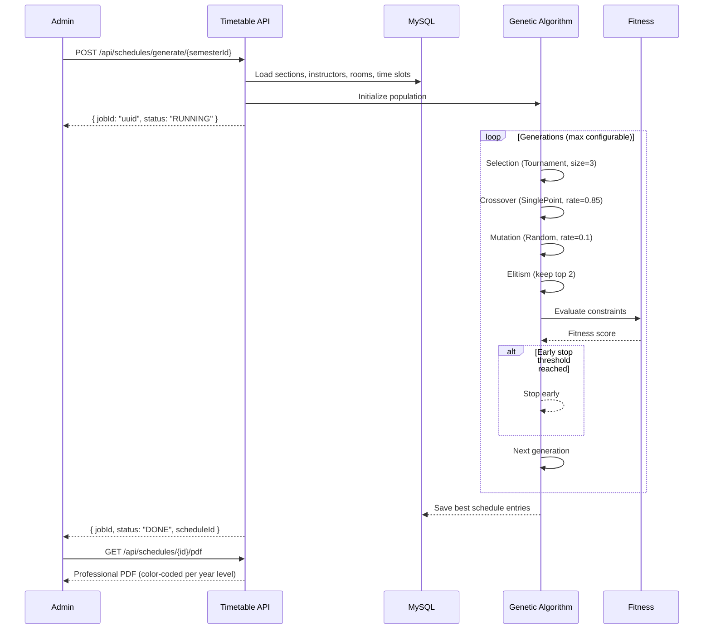

<div align="center">


<br/>

**Production-ready REST API for conflict-free university timetable generation using Genetic Algorithm optimization.**  
Upload your courses, instructors, rooms, and sections — let the GA find the optimal schedule automatically.  
Export to **professional PDF** or **Excel** with color-coded year-level tables.

<br/>


[](https://github.com/)
[](https://github.com/)
[](https://github.com/)

</div>

---

## 📋 Table of Contents

- [Overview](#-overview)
- [System Architecture](#-system-architecture)
- [Schedule Generation Flow](#-schedule-generation-flow)
- [Features](#-features)
- [API Reference](#-api-reference)
- [Database Schema](#-database-schema)
- [Genetic Algorithm](#-genetic-algorithm)
- [Tech Stack](#-tech-stack)
- [Package Structure](#-package-structure)
- [Getting Started](#-getting-started)

---

## 🌐 Overview

**Timetable Scheduler** automates the NP-Hard problem of university timetabling. Instead of spending days manually arranging courses, instructors, rooms, and time slots, this system uses a **Genetic Algorithm** to find a conflict-free, optimized schedule in minutes.

### What makes this different from a typical CRUD API?

| Challenge | How Timetable Scheduler solves it |
|---|---|
| Timetabling is NP-Hard | **Genetic Algorithm** with tournament selection, crossover, and mutation |
| Manual scheduling is error-prone | **Hard constraints** prevent room conflicts, instructor overlaps, and capacity issues |
| Schedules need fine-tuning | **Soft constraints** minimize idle gaps and back-to-back lectures |
| Exporting is a hassle | **Premium PDF** (landscape A4, color-coded, AM/PM, Legend) + **Excel** export |
| Multiple year levels | **YearLevel enum** groups sections into FIRST–FOURTH with per-level tables |
| Session variety | **SessionType enum** (LECTURE, LAB, TUTORIAL, SEMINAR) with color-coded cells |
| Role-based access | **JWT auth** with ADMIN, SCHEDULER, INSTRUCTOR roles |
| AI readability | **Clean architecture** with layered packages, DTOs, and full Swagger docs |

---

## 🏗️ System Architecture



---

## 🔄 Schedule Generation Flow



---

## ✨ Features

### 🔐 Authentication & Security

- Register & login with email/password
- JWT-based stateless authentication
- BCrypt password hashing
- Role-based access: `ADMIN`, `SCHEDULER`, `INSTRUCTOR`
- All endpoints protected — public only: `/api/auth/**`, `/swagger-ui/**`, `/v3/api-docs/**`
- Production profile with stacktrace disabled, logging at WARN

### 🏫 Academic Data Management (Full CRUD)

| Entity | Endpoints | Description |
|---|---|---|
| **Courses** | GET, POST, PUT, DELETE | Code, name, credit hours, department |
| **Rooms** | GET, POST, PUT, DELETE | Building, room number, capacity |
| **Instructors** | GET, POST, PUT, DELETE | Name, email, department, auto-creates User |
| **Sections** | GET, POST, PUT, DELETE | Name, course, instructor, semester, year level |
| **Semesters** | GET, POST, PUT | Name, start/end date, status |
| **Time Slots** | GET, POST, PUT, DELETE | Day, start/end time |
| **Departments** | GET, POST, PUT, DELETE | Code, name |

### 🧬 Genetic Algorithm

- Tournament selection with configurable size
- Single-point crossover with configurable rate
- Random mutation with configurable rate
- Elitism preserves top solutions
- Early stopping when fitness plateaus
- 6 **hard constraints** (room conflict, instructor overlap, capacity, time overlap, section duplication, student conflict)
- 5 **soft constraints** (idle gaps, back-to-back, day distribution, instructor idle, student idle)

### 📄 Schedule Export

- **Premium PDF** — landscape A4, one page per year level + summary page
  - SATURDAY–THURSDAY full-name columns (Egyptian university week)
  - Color-coded cells: `#DBEAFE` blue=LECTURE, `#DCFCE7` green=LAB/Section, `#FEF3C7` beige=BREAK
  - AM/PM time format with zebra-striped time column
  - BREAK row between AM and PM sessions
  - Course code + name, instructor name (no "Dr." prefix), room, session type in parentheses
  - Legend with colored boxes per session type + usage notes
  - Page number footer on every page with generation date
- **Excel Export** — one sheet per year level, freeze pane, borders, color coding, auto-size columns

### 📊 Schedule Viewing

- Weekly schedule grouped by year level
- Instructor personal schedule view
- Conflict detection with constraint details
- Generation job status polling

---

## 📡 API Reference

All endpoints prefixed with `/api` · Full interactive docs at `/swagger-ui/index.html`

### Authentication

| Method | Endpoint | Description |
|---|---|---|
| `POST` | `/auth/register` | Create account |
| `POST` | `/auth/login` | Login → JWT |

### Academic Data

| Method | Endpoint | Description |
|---|---|---|
| `GET/POST` | `/courses` | List / Create courses |
| `PUT/DELETE` | `/courses/{id}` | Update / Delete course |
| `GET/POST` | `/rooms` | List / Create rooms |
| `PUT/DELETE` | `/rooms/{id}` | Update / Delete room |
| `GET/POST` | `/instructors` | List / Create instructors |
| `PUT/DELETE` | `/instructors/{id}` | Update / Delete instructor |
| `GET/POST` | `/sections` | List / Create sections |
| `PUT/DELETE` | `/sections/{id}` | Update / Delete section |
| `GET/POST` | `/semesters` | List / Create semesters |
| `PUT` | `/semesters/{id}` | Update semester |
| `GET/POST` | `/time-slots` | List / Create time slots |
| `PUT/DELETE` | `/time-slots/{id}` | Update / Delete time slot |
| `GET/POST` | `/departments` | List / Create departments |
| `PUT/DELETE` | `/departments/{id}` | Update / Delete department |

### Schedule Generation

| Method | Endpoint | Description |
|---|---|---|
| `POST` | `/schedules/generate/{semesterId}` | Start GA generation (async) |
| `GET` | `/schedules/jobs/{jobId}` | Poll generation job status |
| `GET` | `/schedules/{id}/pdf` | Export premium PDF |
| `GET` | `/schedules/{id}/excel` | Export Excel |
| `GET` | `/schedules/{id}/conflicts` | List constraint violations |
| `GET` | `/weekly-schedules/{id}` | Full weekly schedule |
| `GET` | `/instructor/schedule/my` | Current instructor's schedule |

### Admin

| Method | Endpoint | Description |
|---|---|---|
| `GET` | `/admin/ping` | Health check |

---

## 🧬 Genetic Algorithm

### Core Operations

| Operation | Strategy | Details |
|---|---|---|
| **Selection** | Tournament Selection | Size=3, random tie-breaking |
| **Crossover** | Single-Point Crossover | Rate=0.85 |
| **Mutation** | Random Mutation | Rate=0.1 |
| **Elitism** | Top N keep | Configurable count |
| **Early Stop** | Fitness plateau | Configurable threshold + generations |

### Constraint System

#### Hard Constraints (must be satisfied)

| Constraint | Description |
|---|---|
| `RoomConflictConstraint` | No two sections in the same room at the same time |
| `InstructorAvailabilityConstraint` | Instructor not available during assigned slot (thread-safe with ConcurrentHashMap) |
| `SectionTimeConflictConstraint` | No overlapping time slots for the same section |
| `RoomCapacityConstraint` | Room capacity ≥ section size |
| `InstructorTimeConflictConstraint` | No two assignments for the same instructor at the same time |
| `StudentConflictConstraint` | No student enrolled in two sections with overlapping time slots |

#### Soft Constraints (optimization targets)

| Constraint | Description | Weight |
|---|---|---|---|
| `InstructorIdleSoftConstraint` | Minimize idle gaps between lectures | 1.0 |
| `InstructorBackToBackConstraint` | Reduce consecutive lectures | 2.0 |
| `SameCourseSameDayConstraint` | Spread same course across days | 1.0 |
| `StudentIdleSoftConstraint` | Minimize student idle time | 1.0 |
| `InstructorGapPreferenceConstraint` | Preferred gap between lectures | 1.5 |

### Fitness Formula

```
Fitness = exp(-(HardViolations × HardWeight + SoftViolations × SoftWeight))
```

- Hard weight dominates (drives toward feasibility)
- Soft weight guides optimization (drives toward quality)
- Values range 0–1 (higher = better)

---

## 🗄️ Database Schema

<p align="center">
  
</p>

---

## 🛠️ Tech Stack

| Layer | Technology | Purpose |
|---|---|---|
| Language | Java 21 | Core language |
| Framework | Spring Boot 3.2.5 | Application framework |
| Security | Spring Security + JJWT 0.11.5 | Stateless JWT auth |
| Persistence | Spring Data JPA / Hibernate 6.4 | ORM & DB access |
| Database | MySQL 8 | Primary data store |
| PDF | OpenPDF 1.3.39 | Premium PDF generation |
| Excel | Apache POI 5.2.5 | Excel export |
| GA Core | Custom implementation | Genetic Algorithm engine |
| Docs | SpringDoc OpenAPI 2.5.0 | Swagger UI |
| Build | Maven | Dependency management |
| Validation | Jakarta Validation 3.0 | Request validation |
| Utilities | Lombok 1.18.32 | Boilerplate reduction |

---

## 📦 Package Structure

```
com.example.timetable
├── config/                   # App configuration
│   ├── DataLoader.java       # Idempotent seed data
│   ├── SecurityConfig.java   # JWT + role security
│   ├── OpenApiConfig.java    # OpenAPI documentation
│   ├── DataInitializer.java  # Seed data initializer
│   └── AsyncConfig.java      # Async task configuration
├── controller/
│   ├── academic/             # CRUD endpoints
│   │   ├── CourseController.java
│   │   ├── DepartmentController.java
│   │   ├── InstructorController.java
│   │   ├── RoomController.java
│   │   ├── SectionController.java
│   │   ├── SemesterController.java
│   │   └── TimeSlotController.java
│   ├── schedule/             # Schedule & export endpoints
│   │   ├── ScheduleController.java
│   │   ├── WeeklyScheduleController.java
│   │   └── InstructorScheduleController.java
│   ├── auth/                 # Authentication
│   └── admin/                # Admin utilities
├── dto/
│   ├── request/              # Request DTOs with validation
│   └── response/             # Response DTOs
├── entity/
│   ├── enums/                # SessionType, YearLevel, SemesterStatus, UserRole
│   ├── Course.java
│   ├── Department.java
│   ├── Instructor.java
│   ├── Room.java
│   ├── Section.java
│   ├── Semester.java
│   ├── TimeSlot.java
│   ├── Schedule.java
│   ├── ScheduleEntry.java
│   └── User.java
├── exception/                # Global exception handler
├── mapper/                   # Entity ↔ DTO mappers
├── repository/               # Spring Data JPA repositories
├── scheduling/
│   ├── algorithm/            # GA engine
│   │   ├── config/           # GAProperties, CrossoverConfig, etc.
│   │   ├── crossover/        # SinglePointCrossover
│   │   ├── mutation/         # RandomMutation
│   │   ├── selection/        # TournamentSelection
│   │   ├── GeneticAlgorithm.java
│   │   ├── Chromosome.java
│   │   ├── Gene.java
│   │   └── FitnessCalculator.java
│   ├── constraints/
│   │   ├── hard/             # 6 hard constraints
│   │   └── soft/             # 5 soft constraints
│   ├── algorithm/
│   │   └── config/           # GA config, constraint config
├── service/
│   ├── impl/                 # Service implementations
│   ├── SchedulePdfService.java    # Premium PDF generation
│   ├── ScheduleExcelService.java  # Excel export
│   ├── GeneticScheduleService.java # GA orchestration
│   ├── ConflictEvaluationService.java
│   └── (interfaces)
└── TimetableSchedulerApplication.java
```

---

## 🚀 Getting Started

### Prerequisites
- Java 21+
- MySQL 8+
- Maven 3.8+

### Setup

```bash
# 1. Clone
git clone https://github.com/MahmoudYoussef-web/Time-Table.git
cd Time-Table

# 2. Create database
mysql -u root -p -e "CREATE DATABASE timetable_db;"
```

```properties
# 3. Configure src/main/resources/application.properties
spring.datasource.url=jdbc:mysql://localhost:3306/timetable_db?useSSL=false&serverTimezone=UTC&allowPublicKeyRetrieval=true
spring.datasource.username=dev_user
spring.datasource.password=Dev@2026#

server.port=8081
```

```bash
# 4. Run
mvn clean install
mvn spring-boot:run

# 5. Open Swagger UI
open http://localhost:8081/swagger-ui/index.html
```

### Default Admin Credentials

After startup, the `DataLoader` creates a default admin:

| Field | Value |
|---|---|
| Email | `admin@uni.com` |
| Password | `admin123` |
| Role | `ADMIN` |

### Generate Your First Schedule

```bash
# 1. Login
curl -X POST http://localhost:8081/api/auth/login \
  -H "Content-Type: application/json" \
  -d '{"email": "admin@uni.com", "password": "admin123"}'

# 2. Save the JWT token from response

# 3. Generate schedule for semester 1
curl -X POST http://localhost:8081/api/schedules/generate/1 \
  -H "Authorization: Bearer <token>"

# 4. Export PDF
curl -X GET http://localhost:8081/api/schedules/{id}/pdf \
  -H "Authorization: Bearer <token>" \
  --output schedule.pdf
```

---

## ⚙️ GA Configuration

All GA parameters in `application.properties`:

```properties
ga.population-size=500
ga.max-generations=1000
ga.crossover-rate=0.85
ga.mutation-rate=0.1
ga.elitism-count=2
ga.early-stop-threshold=0.001
ga.max-execution-millis=600000
ga.random-seed=42
```

---

## 🧪 Testing

```bash
mvn test
```

Tests included:
- `SoftConstraintInjectionTest` — verifies all 10 constraints registered with positive weights
- `GlobalExceptionHandlerTest` — verifies 404/400/409 error responses

---

## 👤 Author

**Mahmoud Youssef** · El Shorouk Academy, 2026

[](https://github.com/MahmoudYoussef-web)
[](https://www.linkedin.com/in/mahmoud-youssef-dev/)

---

<div align="center">
  <sub>Open to remote & international opportunities · Graduation Project 2026</sub>
</div>
